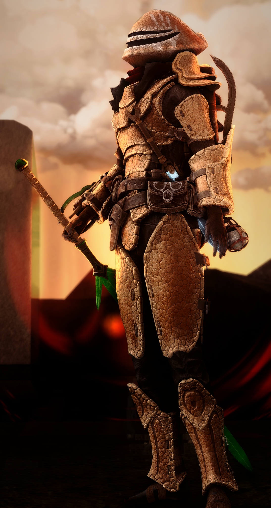
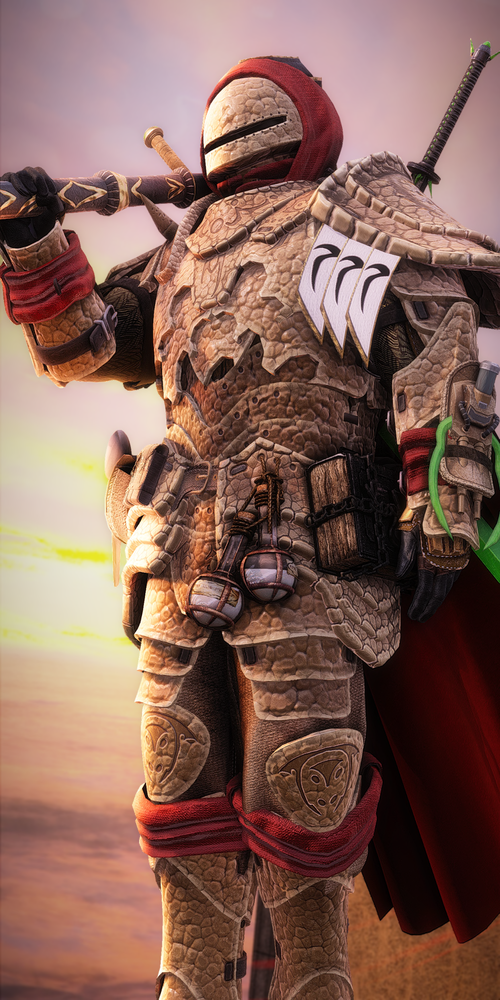
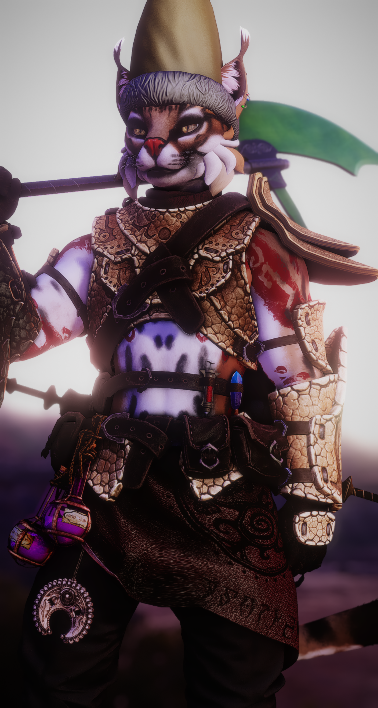
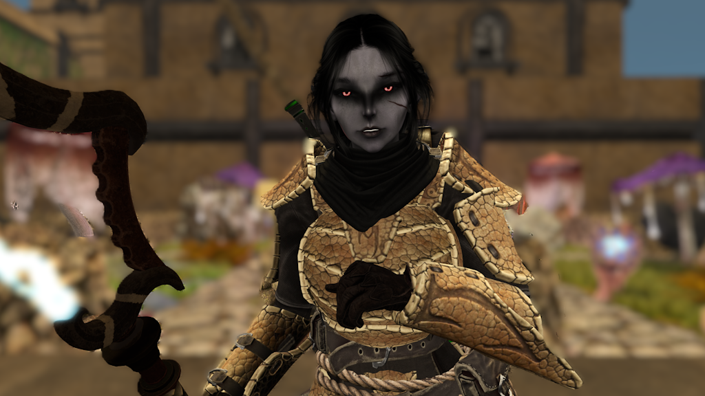

# Ashguard Combat Avatar Policy

Ashguard has always had a strong emphasis on personal creative freedom. To enable this, we have put a lot of effort into creating many jigsaw pieces for every member to puzzle themselves together with their own unique "Ashguardian".

With this in mind, and with the considerably larger arsenal of unique Ashguard assets now available to our members, we have decided to enact this new Ashguard Combat Avatar Policy. This is to maintain a strong sense of identity, promote a good ethos when it comes to low-lag and efficient combat avatars, and keep us looking respectable in other people's sims and spaces where we may be doing combat or representing ourselves to the wider community.

As such, every Ashguard member should have a dedicated combat-ready avatar that represents our organization professionally, primarily for use in combat and on excursions. This document serves as a guide and outlines the rules that apply to your new Ashguardian.

## Create Your Combat Avatar

Creating your Ashguardian should be a fun and engaging effort in building your coolest Ashguard character while overcoming the pitfalls and hurdles most don't even try to conquer! The goal is to kill scripts, be efficient, easy to maintain, and most importantly, be your most awesome Ashguardian self.

Please note that we are not demanding you wear a complete set of Ashguard armor and nothing else! The goal is to maintain your identity in the character you create while also representing the Ashguard group and the above-mentioned respectability in other people's spaces.

### As a guide:

Your combat avatar must be visually recognizable as a member of the Ashguard. You are not required to wear every armor piece from our kits, but your loadout should clearly read as Ashguard at a glance, a soldier clad in their ancestral bonemold atop their leather or cloth undersuit.

Ashguard is based upon Elder Scrolls lore, so there is a great deal of inspiration to choose from while maintaining the soldier of Morrowind aesthetic in the kits we provide. Whether you want to appear as a champion of one of the great houses, a worshipper of one of our three gods, or a lone wizard — you can do that here and still maintain our strong identity.

You can still use assets from stores to add to your look. Remember, however: Make sure all extra bits and gizmos fit into our style! There are no cyborgs in Morrowind!

<table>
<tr>
<td></td>
<td></td>
</tr>
</table>

## The Rules For Your Ashguardian

### You Must Have Combat-Appropriate Presentation

Your combat avatar must be non-sexual in nature. This means:

- No sexually suggestive attachments or clothing elements (this includes bulge underwear and the like)
- No NSFW scripts or features on the combat outfit
- Exposed skin is fine where it makes sense with your armor configuration — we're not requiring full coverage, but the overall look should be combat-focused, not provocative

Outside of combat operations, what you wear is entirely your choice. Second Life is a creative platform, so express yourself freely.

### Keep Your Build Clean

- Remove unnecessary scripts, particle effects, and non-combat attachments from your combat outfit. A clean build helps with sim performance and keeps focus on the fight.
- Do not have any non-Ashguard combat attachments without approval. This typically includes non-Ashguard HUDs and weapons.

<table>
<tr>
<td></td>
<td></td>
</tr>
</table>

## Approval Process

### Outfit Review

All combat avatars must be reviewed and approved by a commanding member before deployment. To get approved:

- Present your combat avatar to any available commanding member
- Approvals will be logged and shared among command staff
- If your outfit is not approved, you'll receive specific feedback on what to adjust

## Compliance Timeline

All members will have roughly 3 weeks from the announcement date (Announced on April 4, 2026, Enacted May 4, 2026)  to build and submit their combat avatar for approval. After this time, you may be unable to participate in combat until you have completed your combat Ashguardian.

