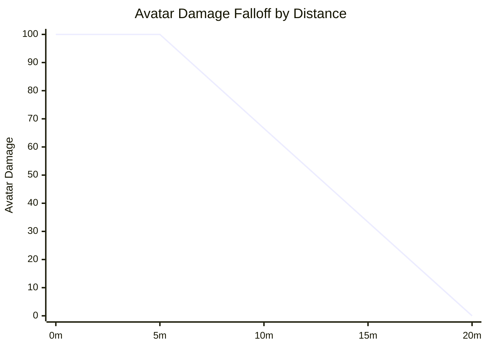
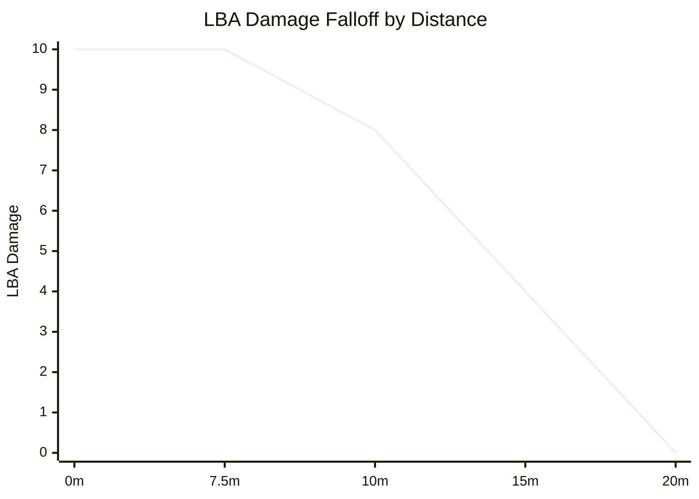
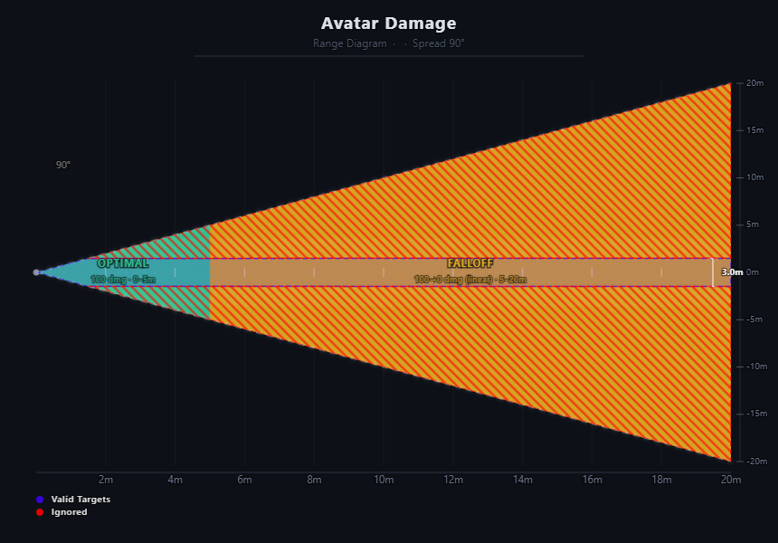
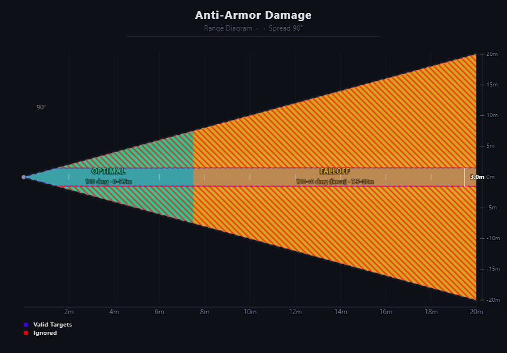

# [Ash] - Flame Torrent v1.3.0
## Specs
| Name                | Value        |
|---------------------|--------------|
| Layer               | L2R          |
| Range               | 20m          |
| Full Damage Range   | 5m           |
| Cone                | 45°          |
| Avatar Damage       | 100          |
| LBA Damage          | 10           |
| Tick Rate           | 0.075s       |
| Mana Cost per Tick  | 5.4          |
| Total LBA (full mana) | ~185       |
| Damage Type         | Fire         |

## Commands
All Commands Are On Channel 1. Default keybinds are listed below.

| KeyBind    | Chat Command | Description      |
|------------|--------------|------------------|
| Shift + 2  | d2           | Draw weapon       |
| —          | s2           | Sling weapon      |
| Hold LMB   | —            | Fire flame torrent|

### Damage Falloff
Damage scales linearly from full to zero between the full damage range and max range.
- **Pass 1 – Avatars:** 20m range, 45° cone. Targets must **both** pass a line-of-sight raycast **and** fall within 1.5m of the camera's aim line. The avatar directly under the crosshair (center raycast hit) always receives damage regardless of angle.
- **Pass 2 – LBA Objects:** Same range and cone. Targets scripted objects with a description beginning with `LBA.v.`. Uses the same aim validation as Pass 1.

| Distance  | Avatar Damage | LBA Damage |
|-----------|---------------|------------|
| 0 – 5m    | 100           | 10         |
| 7.5m      | 100           | 10         |
| 12.5m     | 50            | ~5         |
| 20m       | 0             | 0          |

> Avatar damage falls off from **5m → 20m**. LBA damage falls off from **7.5m → 20m**.

### Detection
Continuously fires while the mouse button is held, consuming mana each tick. Detection uses a two-pass sensor system:

#### Detection Cone (Top-Down)

