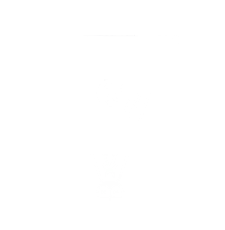
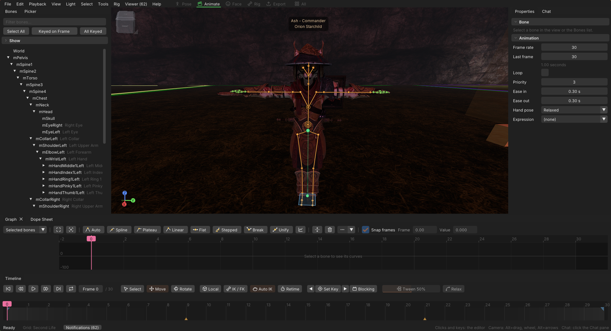
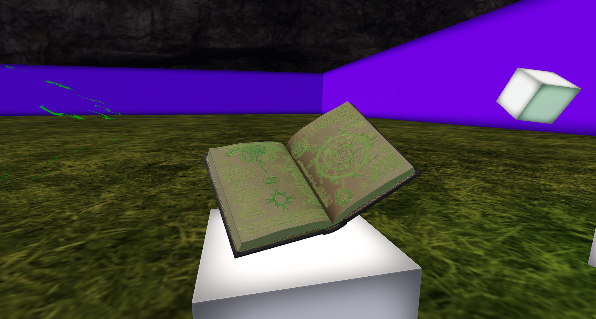
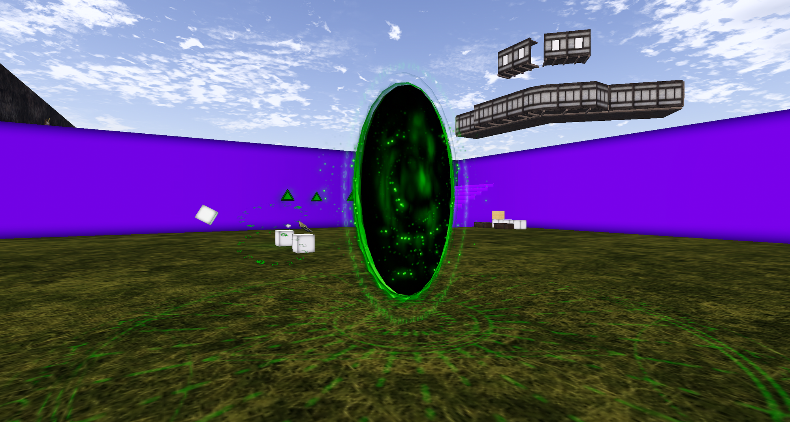
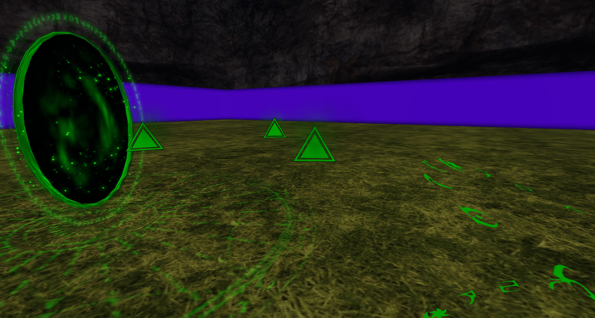
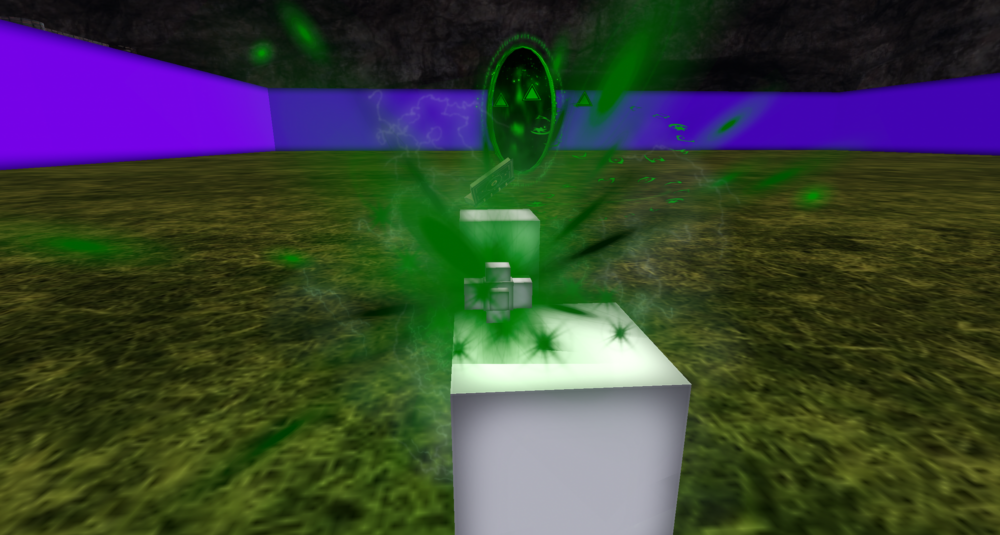
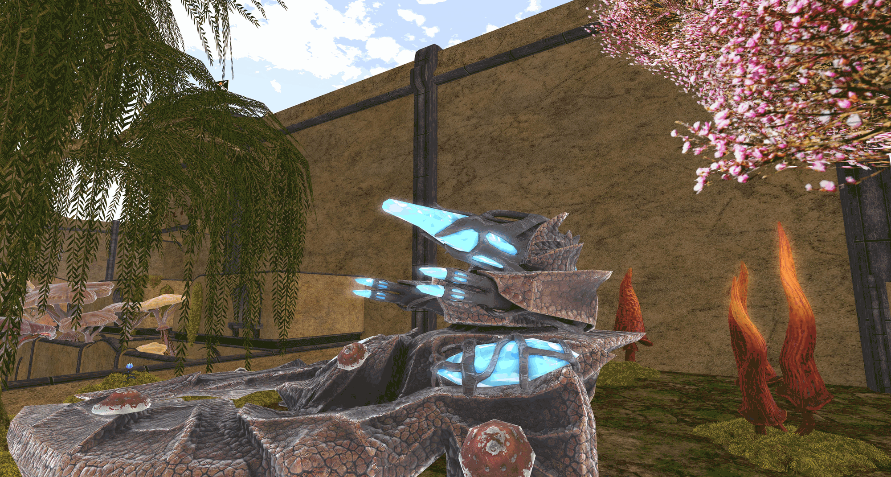
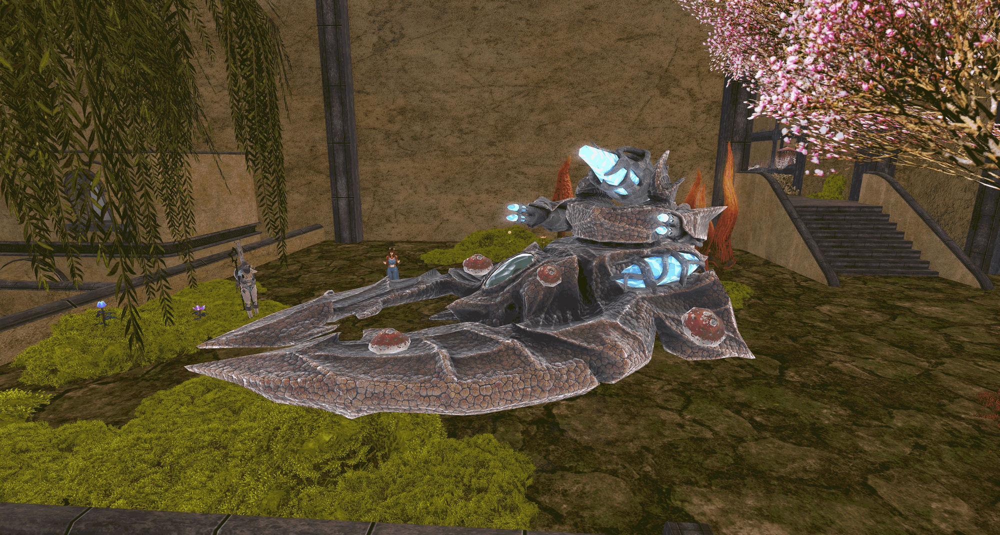
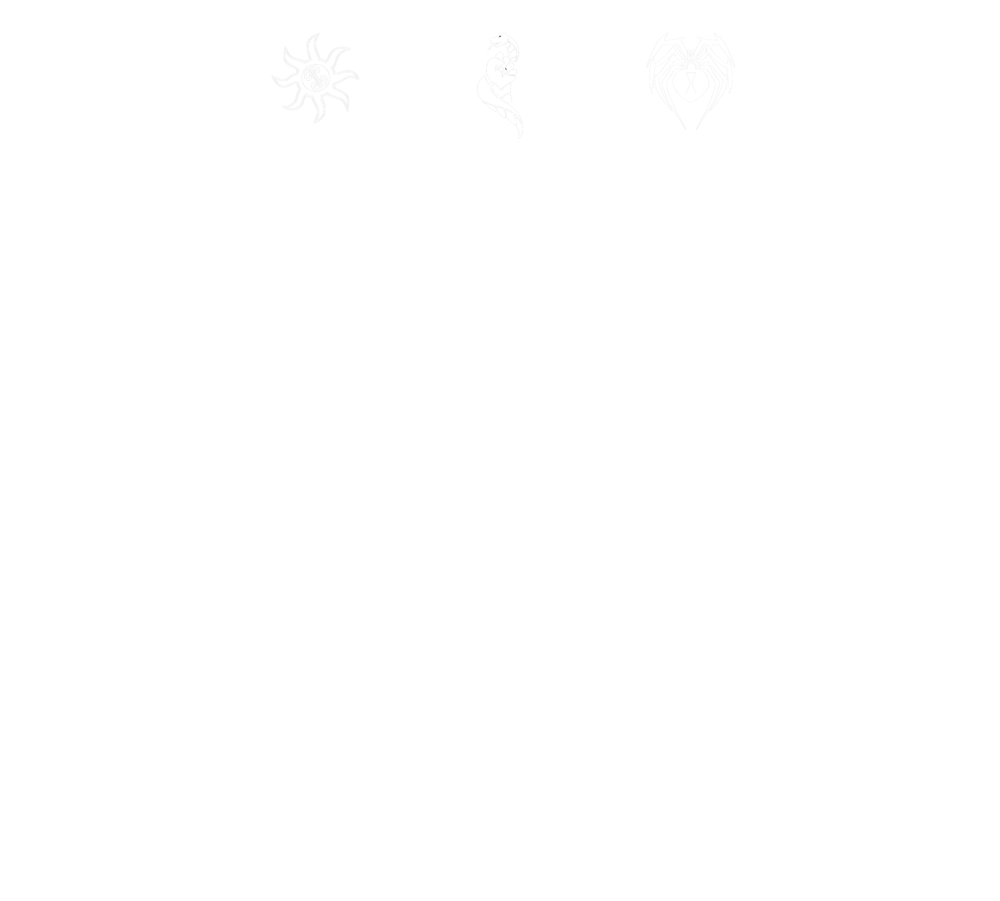

  

# Ashguard Meeting Notes — September 2026

*Welcome to the Ashguard September meeting, which was eaten by spooky month. I had hoped to hit Choss tonight later on, but I have had a very busy day and don't know the plans for the raid as of yet. We will work it out after this, but the raid won't be right after the meeting today.*

---

## SLMC News

Not a lot happening this last month. It has been a really chill month in the SLMC, at least from our perspective.

### VATs

But I suppose it is as good a place as any to refer people to Ashguard General in Discord and **Orion's** post regarding **VATs** (Viewport Avatar Toolset), a really cool in-world (and out-of-world) animation maker for SL that also has rigging features. It will be integrated into SoapStorm too at some stage.

> **Download:** the VATs standalone is available at [github.com/squeedledorf/viewport-avatar-toolset](https://github.com/squeedledorf/viewport-avatar-toolset/releases/latest).

*The VATs editor in Animate mode, with the bone tree, graph editor and timeline.*

---

## Ashguard News

It has also been a quiet wee month for us too. We got in a good few raids, but the whole SLMC seems to be quite mellowed out at the minute. But we do have a couple of major projects I would love to show.

---

## College of Artifice Update

### Tome of the Arcanist

I have had **Skullphern** working on a new tome based on the one from ESO: a book that lets you wield the power of Apocrypha. Skullphern has been working on the effects lately, and I have asked him to prepare a demo of the weapon, which is a good distance away from the final product.

I can tell you the book will contain a tentacle attack, a point-to-point portal ability and a heavy BEEAMMMMMM attack, as well as the simple but no less cool basic projectile attack.

One of the primary features of the tome is that it builds **crux** with kills, and each crux stacks an extra effect onto the other attacks. Using the special attacks after building crux removes the crux stacks. Crux builds up to 3 times, allowing you to build and spend like you might in an MMO.

> **Note:** everything shown here is a work-in-progress demo, not the final product.

*The Tome of the Arcanist itself.*

*The point-to-point portal.*

*Crux markers, which spin around the body as you build stacks.*

*The collision particle on impact.*

### Veloth's Judgement

The Veloth's Judgement has seen a lot of development this month, and we are aiming to get this thing completely finished ASAP. **Soap** has:

- delinked the side cannons in order to make them customizable;
- improved the base rapid-fire side armament so that it fixes in on your mouselook target, which should make it infinitely easier to hit people;
- near finished development on the **Wraith Cannon**.

The Wraith Cannon is based on its namesake from Halo, and I think it will be pretty fun to use.

*The turret and side armament up close.*

*The Veloth's Judgement in full.*

---

## Lil Bits

(Normally) lil bits! As it has been a really slow month, and most of the focus has been on SoapStorm features, the tome and the tank, I really don't have any lil bits this month. So we will move swiftly on.

---

## Promotions

A couple of promotions for September:

| Member                     | Promotion |
| -------------------------- | --------- |
| Variable Tendencies        | E-1 → E-2 |
| Ruqi                       | E-2 → E-3 |
| Carrots                    | E-3 → E-4 |
| Skullphern (now The Lich)  | E-6 → E-7 |

---

## Merits

We do have a few merits to award for this month too, including a good few assassins.

### Besieger and Defender

| Tier       | Merit    | Recipients          |
| ---------- | -------- | ------------------- |
| Apprentice | Besieger | Variable Tendencies |
| Apprentice | Defender | Variable Tendencies |

### Assassin

| Tier       | Recipients                                                                                                         |
| ---------- | ------------------------------------------------------------------------------------------------------------------ |
| Apprentice | Variable Tendencies, Wahler Whimsy                                                                                 |
| Journeyman | Variable Tendencies                                                                                                |
| Expert     | Skullphern, Sadistic Emerald, Soap Frenzy, Mercurial Amethyst, Impish Rizzler, Variable Tendencies, Fox Doji       |
| Master     | Phanuealle Dust, Adama900                                                                                          |

---

*And that is all for the September meeting. Thanks for coming, everyone!*

