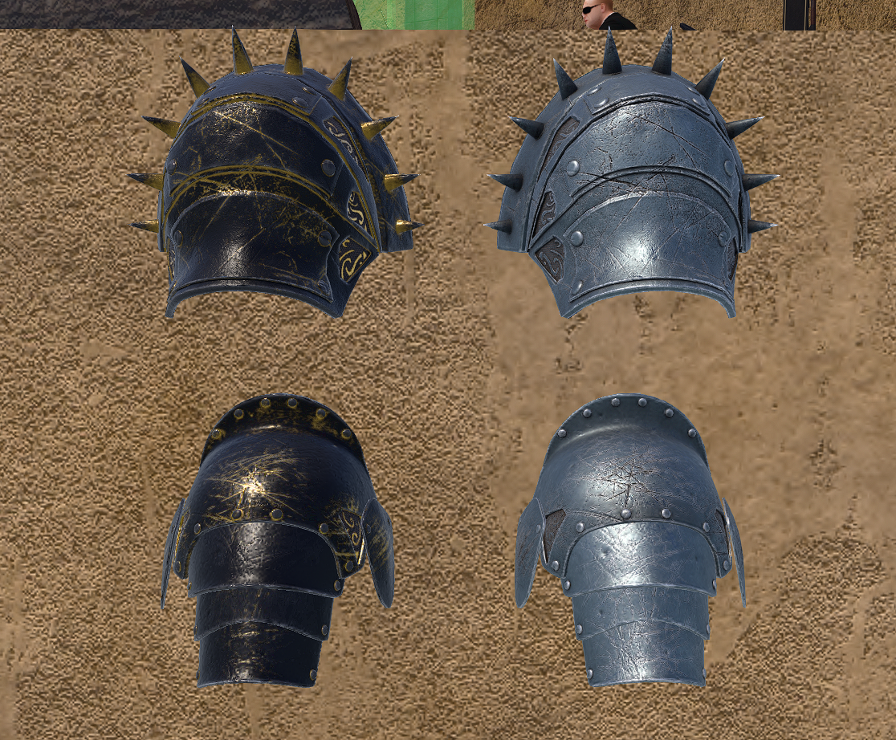
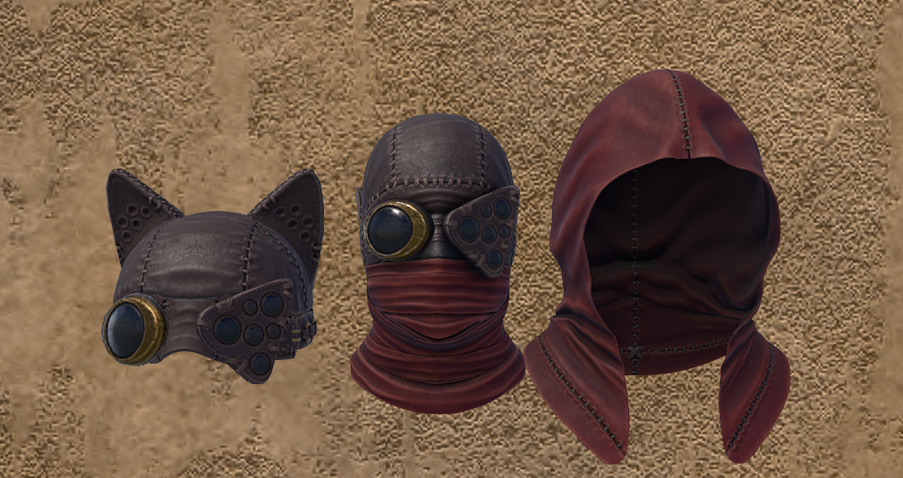
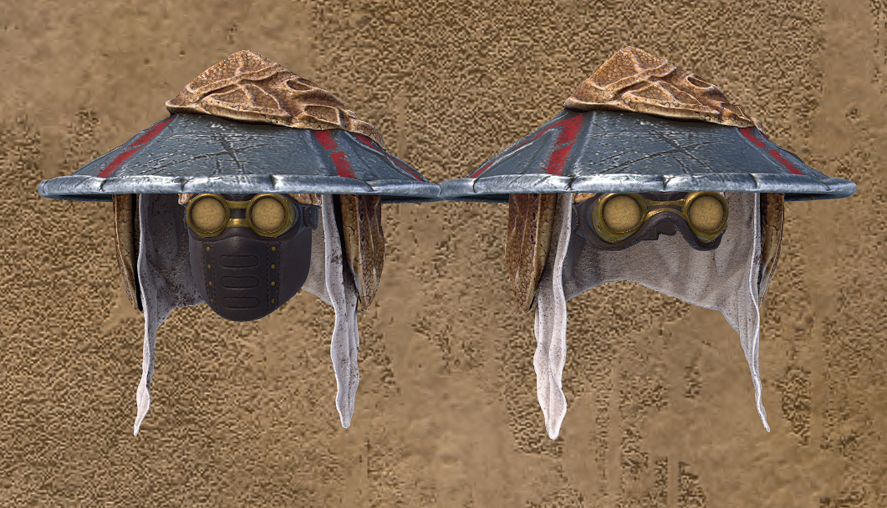
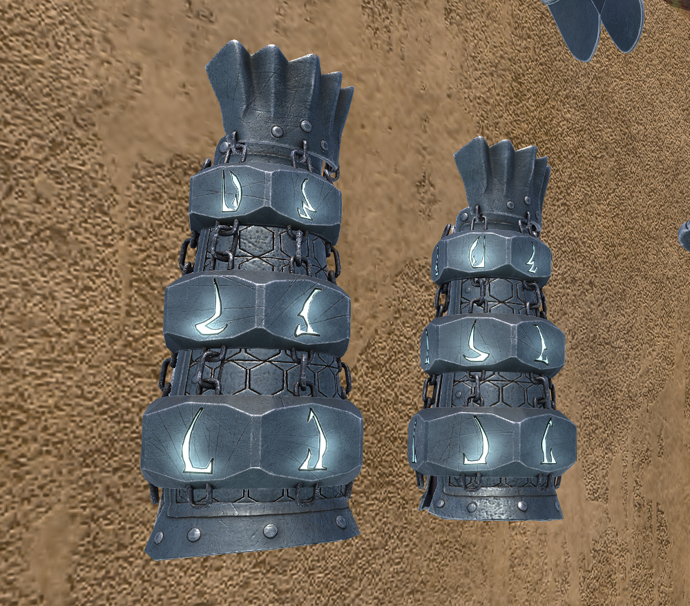

  

# Ashguard Meeting Notes — April 2026

*Welcome to the other April meeting for the Ash group! We have lots of exciting tidbits this month, so let us get started.*

---

## SLMC News

Next month begins **"Mushroom Forest May"**. I was advised by my advisors that this is important knowledge.

The SLMC has seen a bit of an upturn in activity this month, which is good for all of us:

- **Faust** have returned with a new full sim.
- **Grave** has promised a new sim in the next few weeks and has brought his people back into the combat sphere.
- **AN** have said they have put down a new full private region. We will hope for the best with that one, but not get too excited.
- **Megiddo** have redone their sim again and added objectives this time, which is good — I am sure we will give it a go soon.

If we are lucky we will be able to leverage all of this into a more varied selection of targets.

---

## Ashguard News

### Merit Cosmetic Rewards

We have spent a lot of time and effort with **Shiri** to create the cosmetic rewards for the merits, which you can find on our new docs site at [docs.ashguard.net](https://docs.ashguard.net/). Soap can kindly display the models in-world. I am very excited about these and cannot wait to unlock them myself — no doubt we will expand upon this system going forward.

*Raider and Besieger pauldrons.*

*Morag Tong Shadow Hood and Mask.*

*Duststorm Goggles and Ash Jingasa.*

*Specialist's Rune Bracer.*

On top of this, we have plans for a way to show your merit unlocks alongside these cosmetics — our version of the ribbons and such that other groups have. I don't have anything to show off yet, but I think it will be something we can release soon.

### College of Artifice Update

The Artificers have begun work on updating our older armory gear. We created a list in the development forum for the Artificery to work through:

- **Mortar 2.0** — already done. Reworked existing munitions and added extras.
- **Glass Katana** — in development. I think it will be a nice addition to our melee arsenal.
- **Underslung Soulseeker** — Soap has added in the underslung equivalent to the Soulseeker. Exact details are on the docs site. This is a much-requested and awesome addition to what is effectively our standard-issue rifle.

A reminder on the Soulseeker itself: it is not something to generally snub. If you haven't tried it in favour of the Tempest, you should give it a go.

### A Little Extra

Shiri created an inner armor neck piece to go with the Telvanni set, which you can get from the box. I don't think Soap put it out standalone, but you may be able to ask them directly for a copy so you don't have to fill your inventory with a second unboxed armor set.

### Combat Avatar Policy Reminder

The **Combat Avatar Policy** announced last meeting will be coming into effect very soon. To reassure everyone: this policy only applies to **combat actions and expeditions**. You can still dress down at other times, which is the serious majority of the time.

- [Ashguard Combat Avatar Policy](https://docs.ashguard.net/#documents/Ashguard%20Combat%20Avatar%20Policy)

---

## Promotions

### Enlisted

| Member               | Promotion |
| -------------------- | --------- |
| Kel Solstice (Bambi) | E-4 → E-5 |
| Pony Enthusiast      | E-5 → E-6 |

Bambi got on quite a few raids this last little while, which is great — we love having your dry wit in our raiding parties.

Pony, much like the rest of us Europeans, struggles to get on every raid, but it's the ones you do make that count. Thanks for being active.

### NCO Promotions

For the first time since the rank restructure, we are promoting **Ashguard's first NCOs**:

| Member         | Promotion |
| -------------- | --------- |
| Keller (Devin) | → NCO 1   |
| Mercurial      | → NCO 1   |

Mercurial and Keller have been in the group for a very long time and have contributed in a multitude of ways, so this was a natural choice. For the longest time in Ashguard, due to our slow growth, we only had NCOs and Command — after the rank shakeup I was eager to complete the command structure, and these two shone as the likely candidates. I am really pleased that we can now promote them up to NCO 1, after I was *toxic* and made them complete the entire rank structure again.

Welcome to the administrative branch of the Ashguard, guys. We really need to work on some kind of cosmetic for NCO+...

---

## Merits

Nothing too exciting this month as we are still revving up the backend systems, but don't worry — we are keeping our eyes on rewarding people and adding set milestones that the system will automatically track, so it is fair for everyone.

The **Apprentice Defender** merit is awarded to:

- Lemur Incognito
- KingRadzilla
- Greiving
- TybaltKuck

---

*And that is all this month. Thank you for coming, everyone!*

