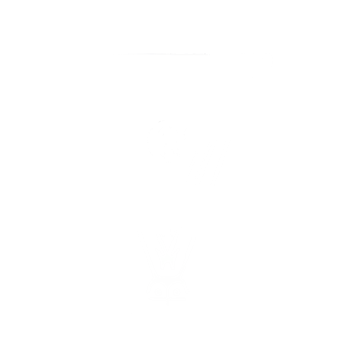
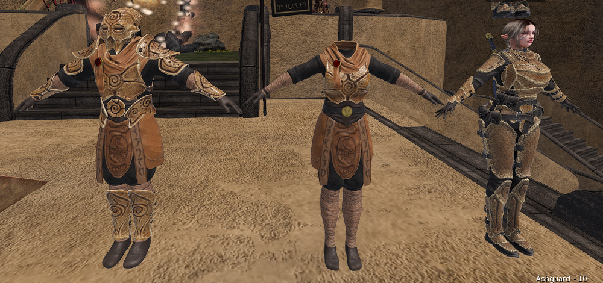
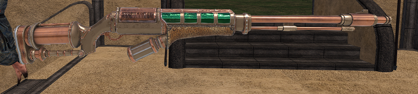

  

# Ashguard Meeting Notes — March 2026

*Meeting held April 4th, 2026. Thank you to everyone who was able to attend.*

---

## College of Artifice Update

### New Telvanni Armor Set

Shiri has completed their part of the new Telvanni set. You may have seen the new undersuit that comes with it previously, but here is the set in completion. We don't have a release date or mote cost just yet, so now might be a good time to start saving!

### Kagrenac Bolt-Cannon

The Kagrenac Bolt-Cannon has been released by Soap. This is a pricy Layer 3 heavy weapon that requires its sister weapon, the Bolt-Caster, to purchase. It's a big escalation pusher that can be very powerful in the right hands and a lot of fun to use.

### Broodmother Rifle (Coming Soon)

Phanuealle Dust is working on the Broodmother, a new bug-based rifle. More details to come.

### Crystal Tome

Skullphern released the Crystal Tome, a special all-layers weapon and the first to use the book model and animations. It has a no-mote cost prerequisite (the Levitation spell) and uses all three of your layers, relying on your mana. There are lots of abilities in there you will thoroughly enjoy.

### Veloth's Judgement Updates

Veloth's Judgement has received several updates:

- **Respawn timer** now based on health. If you can't move after jumping in, this is not a bug; it's the respawn timer.
- **Boost mechanic** has been reworked to be more user-friendly.
- **Mushrooms** have been added. This is an initiative the SLMC should have had a long time ago, it allows us to make tanks that bit more unique and special.

### Upcoming Artificery Work

Shiri has some free time, so we plan to have them build out our merit rewards. We had intended to do this a while back, but it didn't go to plan. We also hope to have time for a rework of the Dovah-Fly ornithopter, but time will tell.

---

## Promotions

| Member             | Promotion |
| ------------------ | --------- |
| Phanuealle Dust    | E-3 → E-4 |
| Skullphern         | E-4 → E-5 |
| Fox Doji           | E-5 → E-6 |
| Vile Whisper       | E-5 → E-6 |
| Ritual Whisper     | E-5 > E-6 |
| Mercurial Amethyst | E-6 → E-7 |
| Keller             | E-6 → E-7 |

---

## First Merit Awards

We are officially awarding merits for the first time. These first merits come with 50 Motes each. The **Besieger** and **Defender** merits at the Apprentice level are awarded to:

Sadistic, Fox, Skullphern, Ritual, Pony, Penelope, Phanualle, Vile, Mercurial, Bambi, Keller, Gun, Adama, Orion, Soap, and Chap.

Congratulations to everyone who has been active this past month. The full merit documentation will be available soon so you can better understand what each merit is and what you earn for them.

---

## Combat Avatar Policy

Ashguard is introducing a new policy change called the **Combat Avatar Policy**. It is well outlined and straightforward; most members pass it by default.

The idea is to create a combat-focused avatar that promotes our group identity, is safe to use anywhere, and presents the group in the best light. This policy is non-intrusive, and full details can be found on our documentation hub:

- **Documentation hub:** [https://docs.ashguard.net/](https://docs.ashguard.net/)
- **Direct link to the policy:** [Ashguard Combat Avatar Policy](https://docs.ashguard.net/#documents/Ashguard%20Combat%20Avatar%20Policy)

If you have any questions about the policy, feel free to reach out to command staff.

---

*Thank you for coming, everyone!*

